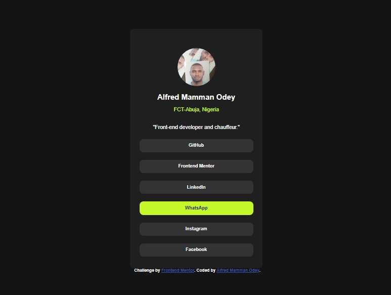

# Frontend Mentor - Social links profile solution

This is a solution to the [Social links profile challenge on Frontend Mentor](https://www.frontendmentor.io/challenges/social-links-profile-UG32l9m6dQ). Frontend Mentor challenges help you improve your coding skills by building realistic projects. 

## Table of contents

- [Overview](#overview)
  - [The challenge](#the-challenge)
  - [Screenshot](#screenshot)
  - [Links](#links)
- [My process](#my-process)
  - [Built with](#built-with)
  - [What I learned](#what-i-learned)
  - [Continued development](#continued-development)
  - [Useful resources](#useful-resources)
- [Author](#author)
- [Acknowledgments](#acknowledgments)


## Overview

### The challenge

Users should be able to:

- See hover and focus states for all interactive elements on the page

### Screenshot



### Links

- Solution URL: [Add solution URL here](https://your-solution-url.com)
- Live Site URL: [Add live site URL here](https://your-live-site-url.com)

## My process
As always: look at the sample from time to time, and build the solution to look like it as closely as possible.

### Built with

- Semantic HTML5 markup
- CSS custom properties
- Flexbox
- Mobile-first workflow

### What I learned

I learned a littl about Flexbox, and developing for mobile and desktop view at the same time.

```html
<h1>Some HTML code I'm proud of</h1>
```
```css
@media (min-width: 600px) {
    header {
        margin-left: 725px;
        margin-top: 100px;
        width: 350px;
    }


}


### Continued development

I just realized that I do not know enough CSS. I still need to learn more about it.

### Useful resources

- [Example resource 1](https://www.freecodecamp.org/news/responsive-web-design-how-to-make-a-website-look-good-on-phones-and-tablets/) - This helped me for mobile and desktop layout. I really liked this discovery and will use it going forward.
- [Example resource 1](https://www.freecodecamp.org/news/responsive-web-design-how-to-make-a-website-look-good-on-phones-and-tablets/) - This is an amazing article which helped me finally understand XYZ. I'd recommend it to anyone still learning this concept.


## Author

- Frontend Mentor - [@AlfredOdey](https://www.frontendmentor.io/profile/AlfredOdey)

## Acknowledgments

I thank Freecodecamp for writing an article about responsive design, and making it free.
